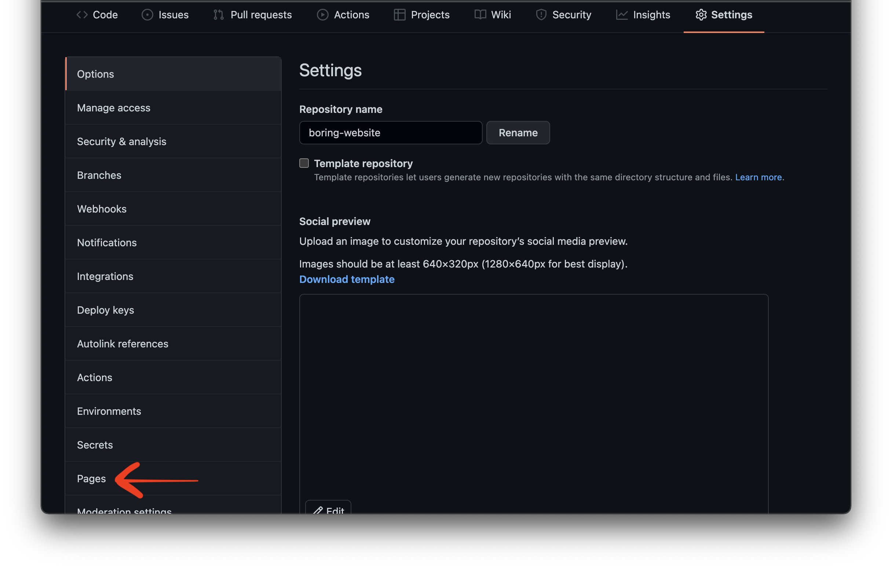
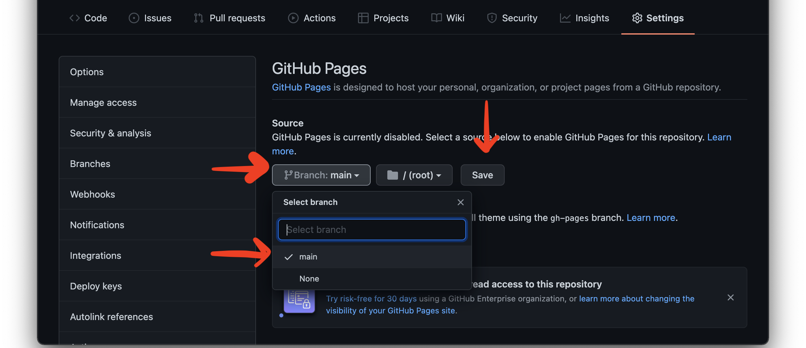

# Publishing with GitHub Pages

This guide explains how to publish your workshop visualisation online using GitHub Pages.

You should only publish from **your own GitHub repository** or **your own fork** of the teaching repository.

Do **not** push changes to the teaching repository.

---

## Contents

- [What GitHub Pages does](#what-github-pages-does)
- [Before you publish](#before-you-publish)
- [Step 1: Check that your project works locally](#step-1-check-that-your-project-works-locally)
- [Step 2: Save your latest changes](#step-2-save-your-latest-changes)
- [Step 3: Commit and push your changes](#step-3-commit-and-push-your-changes)
  - [Option A: Commit and push using VS Code](#option-a-commit-and-push-using-vs-code)
  - [Option B: Commit and push using GitHub Desktop](#option-b-commit-and-push-using-github-desktop)
- [Step 4: Open your repository on GitHub](#step-4-open-your-repository-on-github)
- [Step 5: Open GitHub Pages settings](#step-5-open-github-pages-settings)
- [Step 6: Choose the publishing source](#step-6-choose-the-publishing-source)
- [Step 7: Save and wait for GitHub Pages to publish](#step-7-save-and-wait-for-github-pages-to-publish)
- [Step 8: Open your live site](#step-8-open-your-live-site)
- [Step 9: Share your published visualisation](#step-9-share-your-published-visualisation)
- [Troubleshooting](#troubleshooting)
- [Official GitHub help](#official-github-help)

---

## What GitHub Pages does

GitHub Pages lets you publish a static website directly from a GitHub repository.

For this workshop, that means GitHub Pages can publish your visualisation files, including:

- `index.html`;
- JavaScript used by D3.js and Leaflet;
- data files in the `data/` folder;
- any CSS, images, or assets included in the project.

Your published visualisation will have a web address that looks similar to this:

```text
https://your-username.github.io/your-repository-name/
```
---

## Before you publish

Before publishing, make sure you have:

- your own GitHub account;
- your own fork or repository;
- the project open in VS Code;
- the visualisation working locally with Live Preview or Live Server;
- your latest changes saved;
- your latest changes committed and pushed to GitHub.

---

## Step 1: Check that your project works locally

Before publishing, check that the visualisation works on your own computer.

1. Open the project folder in VS Code.
2. Open `index.html`.
3. Start the project using Live Preview or Live Server.
4. Check that the page opens in your browser.
5. Check that the map appears.
6. Check that the chart or D3 visualisation appears.
7. Check that the data loads correctly.

Do not publish until the local version is working.

---

## Step 2: Save your latest changes

Before committing, save all your files.

In VS Code, you can save the current file with:

```text
Ctrl + S
```

On Mac:

```text
Command + S
```

You can also use:

```text
File > Save All
```

---

## Step 3: Commit and push your changes

You now need to move your latest local changes to GitHub.

There are two beginner-friendly routes:

| Route | Use this if... |
|---|---|
| VS Code | You are comfortable using the Source Control panel in VS Code |
| GitHub Desktop | You prefer a visual app for commits and pushes |

You only need to use one of these routes.

---

## Option A: Commit and push using VS Code

Use this route if you are working mainly inside VS Code.

1. Open VS Code.
2. Open the **Source Control** tab in the left-hand sidebar.
3. You should see a list of changed files.
4. Review the files listed under **Changes**.
5. Add a short commit message.

For example:

```text
Update workshop visualisation
```

6. Click **Commit**.
7. Click **Sync Changes** or **Push**.

After this, your changes should be visible in your GitHub repository online.

---

## Option B: Commit and push using GitHub Desktop

Use this route if you prefer GitHub Desktop. Use this route if you are using GitHub Desktop to manage your local files.

GitHub Desktop lets you review saved changes, create a commit, and push that commit to your own GitHub repository.

In VS Code, save your latest changes.

On Windows:

```text
Ctrl + S
```

On Mac:

```text
Command + S
```

You can also use:

```text
File > Save All
```
Open GitHub Desktop.

Check the top-left repository dropdown and make sure the selected repository is your own workshop repository.

1. Open GitHub Desktop.
2. Make sure your workshop repository is selected.
3. Review the changed files.
4. Add a short commit summary.

For example:

```text
Update workshop visualisation
```
5. Click **Commit to main**.

This saves a snapshot of your changes on your computer.

At this point, your changes are committed locally, but are not yet be visible on GitHub online.

6. Click **Push origin**.

This uploads your committed changes to your own GitHub repository.

After this, your changes should be visible in your GitHub repository online.

Open GitHub in your browser:

[https://github.com/](https://github.com/)

Open your own workshop repository.

Check that the files you changed are visible online.

---

## Step 4: Open your repository on GitHub

Open GitHub in your browser:

[https://github.com/](https://github.com/)

Then open your own workshop repository.

It should look like:

```text
your-username/uoe_visualization_workshop
```

Check that your latest files are visible.

You should see files such as:

```text
index.html
data/
```

The `index.html` file is important because GitHub Pages will use it as the entry point for the website.

---

## Step 5: Open GitHub Pages settings

In your repository on GitHub:

1. Click **Settings**.
2. In the left-hand sidebar, find **Pages**.
3. Click **Pages**.




If you cannot see **Settings**, check that you are looking at your own repository, not the workshop repository.

---

## Step 6: Choose the publishing source

In the GitHub Pages settings:

1. Find **Build and deployment**.
2. Under **Source**, choose:

```text
Deploy from a branch
```

3. Under **Branch**, choose:

```text
main
```

4. For the folder, choose:

```text
/root
```

or:

```text
/
```

The wording may vary slightly depending on the GitHub interface.

5. Click **Save**.



For this workshop, the usual setting should be:

```text
Source: Deploy from a branch
Branch: main
Folder: /root
```

This works because the project’s main webpage, `index.html`, is in the top level of the repository.

---

## Step 7: Save and wait for GitHub Pages to publish

After clicking **Save**, GitHub will start publishing the site.

This may take a few minutes.

You may see a message saying that your site is being built or deployed.

Refresh the Pages settings page after a short time to check whether the site is live.

---

## Step 8: Open your live site

When the site is published, GitHub will show a link to your live site in the Pages settings.

It will look similar to this:

```text
https://your-username.github.io/your-repository-name/
```

Click the link to open your published visualisation.

---

## Step 9: Share your published visualisation

Once your site is live, you can share the URL.

For example:

```text
https://your-username.github.io/uoe_visualization_workshop/
```

Before sharing, check:

- the page loads;
- the map appears;
- the chart appears;
- the data loads;
- links and images work;
- the URL is from your own GitHub account.

---

## How to update your published site

If you make more changes after publishing, you do not need to set up GitHub Pages again.

To update the live site:

1. Edit the files locally in VS Code.
2. Save your changes.
3. Commit your changes.
4. Push or sync the changes to GitHub.
5. Wait for GitHub Pages to rebuild the site.
6. Refresh your live site in the browser.

The same GitHub Pages link should update after the new changes are published.

---

## GitHub terms used in this guide

This guide uses a few GitHub terms. You do not need to memorise them, but the table below explains what each one means in the workshop.

| Term | what it means|
|---|---|
| **Repository** | A project folder stored on GitHub. It contains your files, such as `index.html`, the `data/` folder, and any images or assets. |
| **Workshop repository** | The shared workshop repository provided by the instructors.      |
| **Fork** | Your own copy of the teaching repository under your GitHub account. This is the version you can edit, save, push, and publish. |
| **Local copy** | The version of the project stored on your own computer and opened in VS Code. |
| **Remote repository** | The version of your project stored online on GitHub. |
| **Branch** | A version of the repository. For this workshop, you will usually use the default branch, called `main`. |
| **Commit** | A saved snapshot of your changes. A commit records what changed and includes a short message describing the update. |
| **Commit message** | A short note explaining what you changed, such as `Update workshop visualisation`. |
| **Push** | Uploading your local commits from your computer to your GitHub repository online. |
| **Pull** | Downloading changes from GitHub to your local computer. You may would not need this during the workshop. |
| **Sync Changes** | In VS Code, this usually means checking for changes online and sending your local commits to GitHub. |
| **Origin** | The default name for the online GitHub repository connected to your local copy. In this workshop, `origin` should be your own fork or repository. |
| **GitHub Pages** | A GitHub feature that publishes your repository files as a website. |

For this workshop, the most important idea is:

```text
Edit locally → commit your changes → push to your own GitHub repository → publish with GitHub Pages ````
```


## Troubleshooting

### I cannot see Pages in the sidebar

Make sure you are inside the repository settings.

The path should be:

```text
Repository > Settings > Pages
```

If you still cannot see it, ask for help during the workshop.

---

### GitHub Pages says the site is published, but I see a 404 page

Try the following:

- wait a few minutes and refresh the page;
- check that your repository contains `index.html`;
- check that `index.html` is in the top level of the publishing source;
- check that the selected branch is `main`;
- check that the selected folder is `/root` or `/`;
- check that you are using the correct URL.

The URL should look like:

```text
https://your-username.github.io/your-repository-name/
```

---

### The page loads but the visualisation does not appear

Check:

- that the `data/` folder is included in your GitHub repository;
- that the data file name in the code matches the actual file name;
- that your file paths use the correct spelling and capitalisation;
- that your internet connection is working;
- that D3 and Leaflet links use `https://`;
- that you have refreshed the page after GitHub Pages finished publishing.

---

### The map appears locally but not on GitHub Pages

Check:

- that the Leaflet CSS and JavaScript links use `https://`;
- that the internet connection is working;
- that the browser console does not show errors;
- that the map container has a height set in the CSS.

---

### The data loads locally but not on GitHub Pages

Check:

- that the data file has been pushed to GitHub;
- that the `data/` folder is visible in the online repository;
- that the data path in the code is correct.

For example, if the code says:

```js
d3.json("data/women_doctors_geo.json")
```

then the repository should contain:

```text
data/
  women_doctors_geo.json
```

---

### My changes are not appearing on the live site

Try:

- checking that you committed your changes;
- checking that you pushed or synced your changes to GitHub;
- waiting a few minutes for GitHub Pages to rebuild;
- refreshing the browser;
- opening the site in a private/incognito window;
- checking that you are viewing the correct GitHub Pages URL.

---

### I accidentally published the wrong repository

That is okay.

You can go to the correct repository and repeat the GitHub Pages setup there.

Make sure the repository belongs to your own GitHub account and contains the workshop files.

---

## Official GitHub help

For more detail, see the official GitHub documentation:

- [What is GitHub Pages?](https://docs.github.com/en/pages/getting-started-with-github-pages/what-is-github-pages)
- [Creating a GitHub Pages site](https://docs.github.com/en/pages/getting-started-with-github-pages/creating-a-github-pages-site)
- [Configuring a publishing source for your GitHub Pages site](https://docs.github.com/en/pages/getting-started-with-github-pages/configuring-a-publishing-source-for-your-github-pages-site)
- [Troubleshooting 404 errors for GitHub Pages sites](https://docs.github.com/en/pages/getting-started-with-github-pages/troubleshooting-404-errors-for-github-pages-sites)
- [Pushing changes to GitHub from GitHub Desktop](https://docs.github.com/en/desktop/making-changes-in-a-branch/pushing-changes-to-github-from-github-desktop)

---


[](https://creativecommons.org/licenses/by-nc/4.0/)
