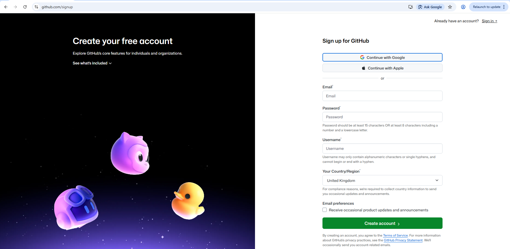
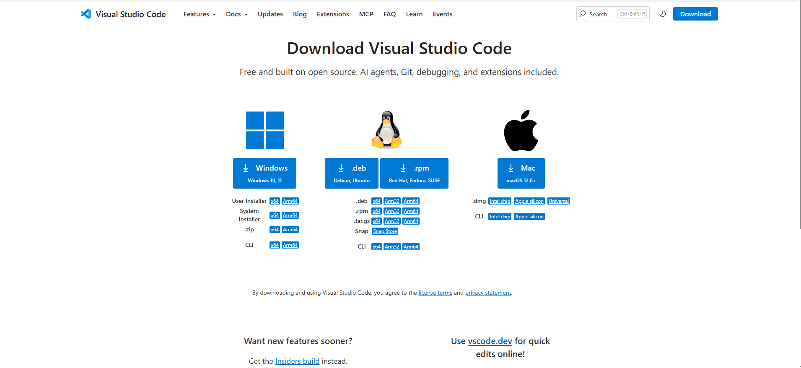
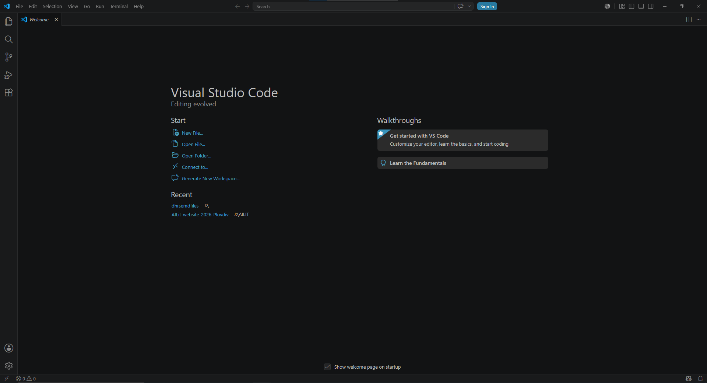
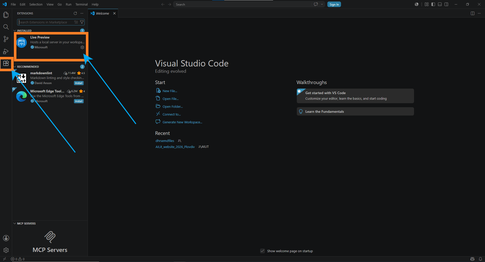
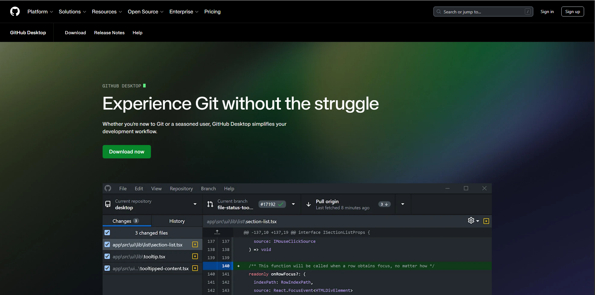
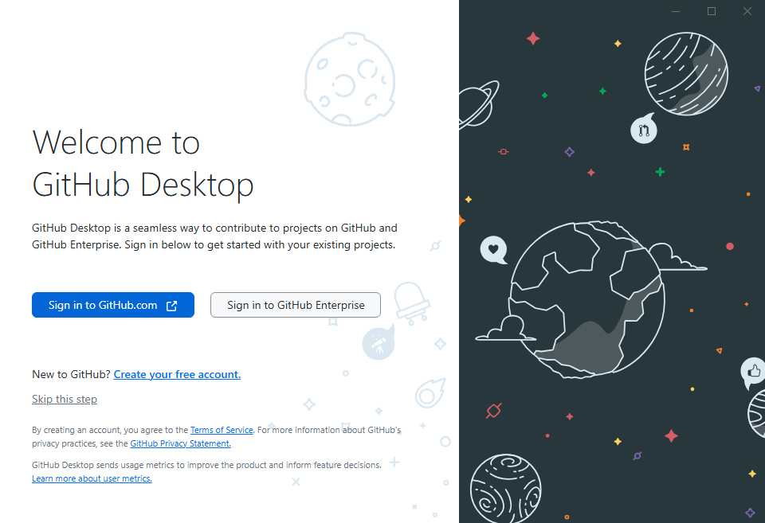
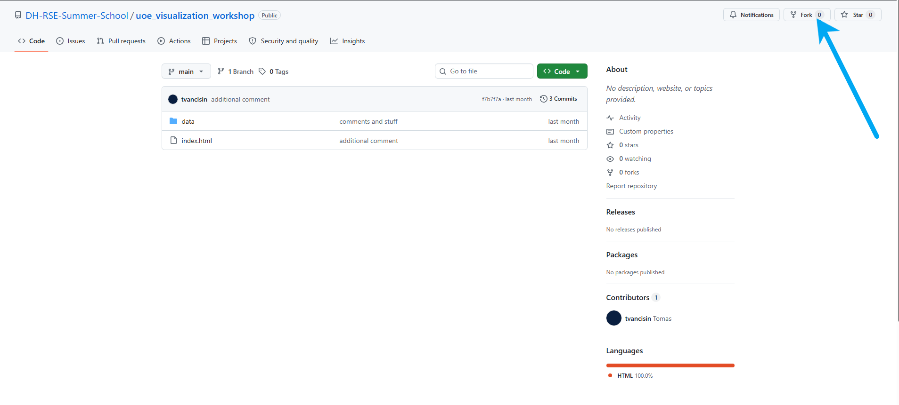
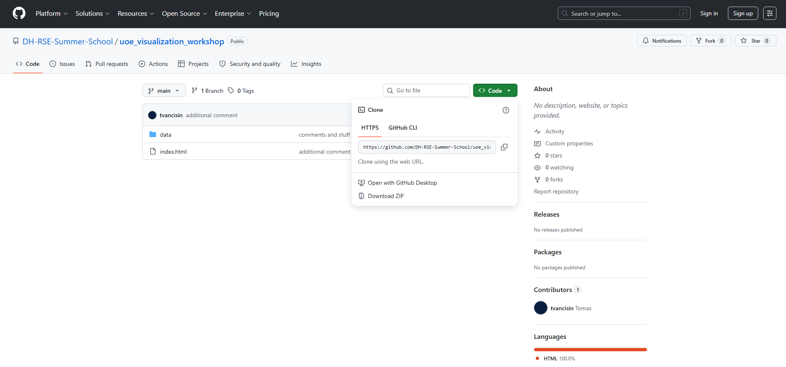
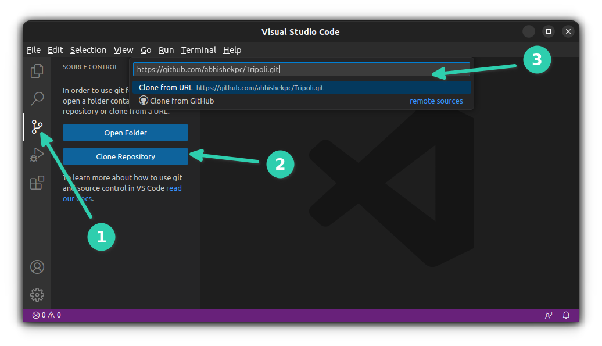

# Setup Before the Workshop

This guide will help you prepare your computer for the workshop.

During the workshop, you will open a prepared visualisation project, edit the files locally in VS Code, and later publish your own version using GitHub Pages.

Please try to complete the installation steps before the session if possible. If you run into problems, do not worry, we can help during the workshop.

---
## Contents

- [What you need](#what-you-need)
- [Workshop repository](#teaching-repository)
- [Your own GitHub repository](#important-use-your-own-github-repository)
- [Step 1: Create or check your GitHub account](#step-1-create-or-check-your-github-account)
- [Step 2: Install VS Code](#step-2-install-vs-code)
- [Step 3: Install a local preview extension in VS Code](#step-3-install-a-local-preview-extension-in-vs-code)
- [Step 4: Prepare a way to connect to GitHub](#step-4-prepare-a-way-to-connect-to-github)
  - [Option A: Use VS Code with your GitHub account](#option-a-use-vs-code-with-your-github-account)
  - [Option B: Install GitHub Desktop](#option-b-install-github-desktop)
- [Step 5: Fork the workshop repository](#step-5-fork-the-workshop-repository)
- [Fallback route: download the starter files](#fallback-route-download-the-starter-files)
- [Step 6: Clone your own fork into VS Code](#step-6-clone-your-own-fork-into-vs-code)
- [Step 09: During the workshop](#step-11-during-the-workshop)
- [Checklist before the workshop](#checklist-before-the-workshop)
- [Next step](#next-step)
## What you need

Before the workshop, preparations list:

- a GitHub account;
- VS Code installed;
- a way to connect your local files to your own GitHub account;
- a browser such as Chrome, or Firefox;
- the Live Preview extension in VS Code.

If you are using a university-managed computer, please check whether you have permission to install software. 

---

## Workshop repository

The workshop starter code/data is available from the current workshop repository where you found the current files - DHRSE -> UoE Vis

---

## Creating your own GitHub repository

The workshop repository provides a template including the document you are currently reading. The idea is that all members should be able to create a copy of the repository to work so that everyone starts with the same files.

With your own copy of the repository you can safely edit the files, save your changes, push your changes to your own GitHub account, and publish your own version of the visualisation.

```text
Workshop repository:
https://github.com/DH-RSE-Summer-School/uoe_visualization_workshop
        ↓
Your fork or own repository
        ↓
Your local copy in VS Code
        ↓
Edit and test locally
        ↓
Push changes to your own GitHub account
        ↓
Publish using GitHub Pages
```

---

## Step 1: Create or check your GitHub account

Go to GitHub and create an account if you do not already have one:

[https://github.com/](https://github.com/)

If you already have a GitHub account, please make sure you can log in before the workshop.



---

## Step 2: Install VS Code

Download and install VS Code from:

[https://code.visualstudio.com/](https://code.visualstudio.com/)

VS Code is the code editor we will use during the workshop.

After installing it, open VS Code once to check that it works.




---

## Step 3: Install a local preview extension in VS Code

We need a way to preview the website locally in a browser while we edit the files.

Please install the extension confirmed by the workshop instructors.

Common options include:

- **Live Preview**;

In VS Code:

1. Open VS Code.
2. Click the **Extensions** icon in the left-hand sidebar.
3. Search for the extension (Live Preview)
4. Click **Install**.
5. Restart VS Code if prompted.



---

## Step 4: A way to connect your local setup to GitHub online

You will need a way to save your edited files back to your own GitHub account.

There are two beginner-friendly options:

| Option | Description |
|---|---|
| 1. VS Code GitHub workflow | Use VS Code’s built-in Source Control tools to commit and sync changes |
| 2. GitHub Desktop | Use the GitHub Desktop app to manage commits and pushes with a visual interface |

You do **not** need to use command line Git for this workshop unless you are already familiar with using it.

With both options, you will need to connect your github account through the tools, Vscode and Github Desktop if you choose that option. Signing in on vscode can be completed with the person icon in the **bottom left** of the vscode window. Then source control button can be used. See below.

---

## Option A: Use VS Code with your GitHub account

This option lets you work mostly inside VS Code.

In VS Code:

1. Open the **Source Control** tab.
2. If prompted, sign in to GitHub/or via the profile icon.
3. Follow the browser sign-in steps.
4. Return to VS Code once sign-in is complete.

During the workshop, you will use this connection to commit and sync changes to your own GitHub repository.

---

## Option B: Install GitHub Desktop

GitHub Desktop is optional, but it may be easier if you are new to Git and GitHub.

Download GitHub Desktop from:

[https://desktop.github.com/](https://desktop.github.com/)

After installing it:

1. Open GitHub Desktop.
2. Sign in with your GitHub account.
3. Check that GitHub Desktop opens successfully.

You can use GitHub Desktop later to commit and push your edited project files.





---

## Step 5: Fork the workshop repository

The recommended route is to **fork** the workshop repository. You should be signed into your person Github account by now.

Forking creates your own copy of the repository under your GitHub account. You can then edit, commit, push, and publish your own version without changing the teaching repository.

1. Open the workshop repository:

   [https://github.com/DH-RSE-Summer-School/uoe_visualization_workshop](https://github.com/DH-RSE-Summer-School/uoe_visualization_workshop)

2. Click **Fork** in the top-right area of the GitHub page.

   

3. Choose your own GitHub account as the owner.

4. Keep the repository name, or rename it to something clear, for example:

   ```text
   uoe-visualisation-workshop
   ```

5. Click **Create fork**.

6. After the fork is created, check that the repository is now under your own GitHub username.

   It should look like:

   ```text
   your-username/uoe-visualisation-workshop
   ```

7. You should now be on your own copy of the repository.


---

## A backup option: download the starter files & folders

If you cannot fork the repository, you can download the starter files instead.

1. Open the workshop repository:

   [https://github.com/DH-RSE-Summer-School/uoe_visualization_workshop](https://github.com/DH-RSE-Summer-School/uoe_visualization_workshop)

2. Click the green **Code** button.

3. Select **Download ZIP**.

4. Unzip the folder on your computer.

5. Open the unzipped folder in VS Code.

6. Later, create your own GitHub repository and upload or push/add the files there. Click add files, ensure that the structure of the data folder and index html are maintained as in the workshop repository.



---

## Step 6: Clone your own fork into VS Code

Once you have your own fork, you can clone it to your computer.

Cloning means making a local copy of a GitHub repository on your computer. This will work if you have already connected your personal account to vscode.

In VS Code:

1. Open VS Code.
2. Open the **Source Control** tab.
3. Click **Clone Repository**.
4. Choose **Clone from GitHub** if prompted.
5. Select your own forked workshop repository.
6. Choose a sensible location on your computer to save the folder.

7. When VS Code asks whether to open the cloned repository, click **Open**.

8. If VS Code asks whether you trust the folder, click **Yes, I trust the authors**.



Then open folder if this does not automatically open in the window.

---
## Step 6.5 for those using Github Desktop

Github desktop allows for a secondary approach for cloning/pushing/commiting and deploying your locally edited files. It has a user friendly interface. It will allow you to clone your forked copy of the workshop repository through the github desktop functions, and set a location for the folder, which you can open in vscode whilst you work through the workshop. Any changes and saves will be recorded, and when ready for step 2, launching and sending the changes to your own github will become simpler. 

1. On your forked repository page, click the green **Code** button.
2. Select **Open with GitHub Desktop**. If your browser asks for permission to open GitHub Desktop, allow it.
2. Choose where to save the project folder
3. Check the **Repository URL** or repository name.
4. Choose a sensible **Local path** on your computer.
5. Click **Clone**.

After cloning, GitHub Desktop should show your workshop repository.

Check that:

- the repository name is correct;
- the selected branch is `main`;
- the top bar shows **Fetch origin**, **Pull origin**, or **Push origin**;
- the local path points to the folder you chose.

For the next step (7) you will have a few options...

In GitHub Desktop:

1. Click **Repository** in the top menu.
2. Click **Open in Visual Studio Code**.

In VS Code:

1. Click **File**.
2. Click **Open Folder**.
3. Find the folder you cloned with GitHub Desktop.
4. Select the folder.
5. Click **Open**.
6. If VS Code asks whether you trust the folder, click **Yes, I trust the authors**.

https://docs.github.com/en/desktop/overview/getting-started-with-github-desktop

## Step 7: Check the project files

When the folder is open in VS Code, you should see files and folders similar to this:

```text
uoe_visualization_workshop/
  index.html
  data/
```

The project will also include the files for instructions:

```text
uoe_visualization_workshop/
  index.html
  data/
  images/
  README_DHRSE_Visualisation2026.md
  Pre_workshop_00_Setup.md
  Part_01_Building_The_Visualisation.md
  Part_02_Publishing_With_GitHub_Pages
  Data_Visualisation_Introduction_A resource.md
```

The most important file for visualisation related code will be:

```text
index.html
```

This is the main webpage for the visualisation.

The `data/` folder contains the data files used by the visualisation.

---

## Step 8: Run the project locally

To preview the project:

1. Open `index.html` in VS Code.
2. Right-click inside the file.
3. Choose **Show Preview**.
4. A window should open with the visualisation.

If the page opens and the map/chart appears, your local setup is working.

---

## Step 09: During the workshop

During the workshop, you will:

1. follow the live demonstration;
2. edit parts of the HTML, JavaScript, or data files;
3. save your changes;
4. preview the visualisation locally;
5. commit your changes;
6. push your changes to your own GitHub repository;
7. publish your own repository using GitHub Pages.

We will guide the process in the session and additional written instructions if you need for following along [Part 2- publishing with GitHub Pages](./Part_02_Publishing_With_Github_Pages.md)

---

## Checklist before the workshop

Before the session, try to make sure you have:

- [1] a working GitHub account;
- [2] VS Code installed;
- [3] Live Preview installed in VS Code;
- [4] GitHub Desktop installed, if you want to use it;
- [5] your own fork of the workshop repository created;
- [6] your own fork cloned into VS Code & connected to github desktop for those using that option;
- [7] the project folder open in VS Code;
- [8] `index.html` opening locally in a browser/preview in vscode;

If you cannot complete every step, do not worry. We can help during the workshop. As long as you attempt steps 1-4 beforehand, we can solve remaining issues in the session.

---

## Next step
The first hands on element of the workshop is noted at [Building the visualisation](./Part_01_Building_The_Visualisation.md)


[](https://creativecommons.org/licenses/by-nc/4.0/)
